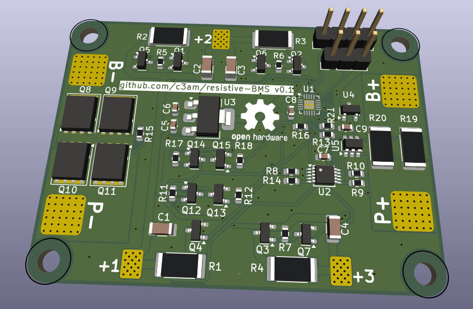

This is a low cost 4s BMS (battery management system) based on the ch32v003 microcontroller.
features:
- Cell voltage measurement using an ads1115 16bit adc
- high side bidirectional current sensing using the ina181a2 current sense amplifier
- charge/discharge enable using low side mosfets
- 20Ohm resistive balancing (-> 200mA at 4V -> 0.8W)
- I/O: 1x Uart, 1x SWIO (for programming)

This BMS is still under development and I haven't even tested it yet.

